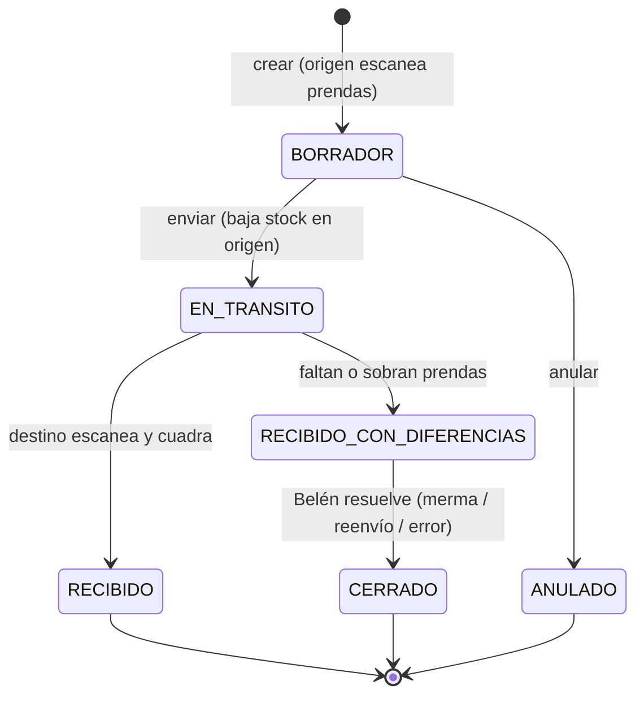
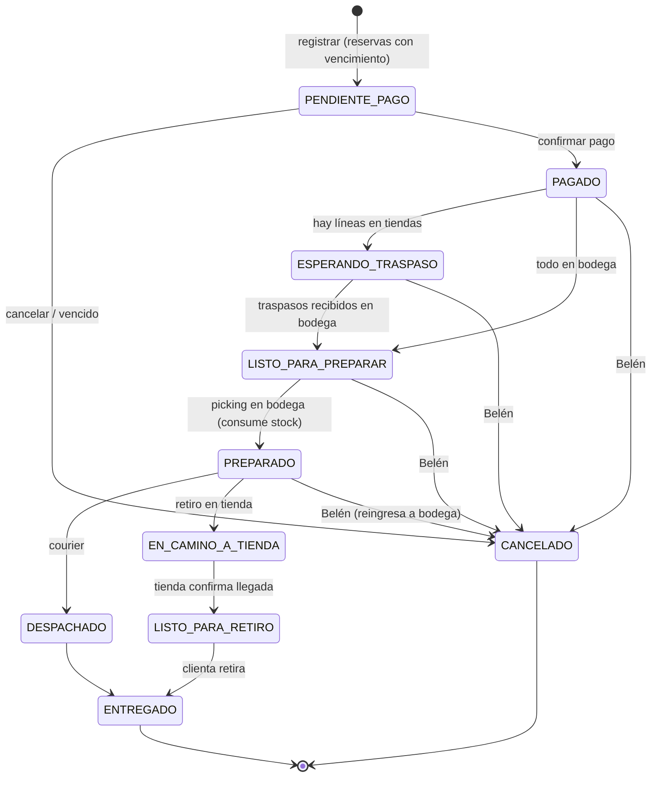

# 02 – Requerimientos

Prioridad: **M** = MVP obligatorio · **D** = deseable en MVP · **F** = fase posterior.
Estado de reglas: ✅ confirmada · 🟡 propuesta (validar con Belén) · ❓ depende de pregunta abierta.

---

## 1. Roles, ubicaciones y permisos

Ubicaciones: `TIENDA_RANCAGUA`, `TIENDA_PROVIDENCIA` (tiendas, con POS) y `BODEGA` (sin atención de público; origen del canal online).

| Acción | Admin (Belén) | Vendedora (su tienda) | Bodega |
|--------|:-----:|:---------:|:------:|
| Gestionar usuarios, ubicaciones y configuración | ✔ | — | — |
| Productos, variantes, precios, promociones | ✔ | — | — |
| Ver costos y márgenes | ✔ | — | — |
| Consultar stock de **todas** las ubicaciones | ✔ | ✔ (solo lectura) | ✔ (solo lectura) |
| Recepción de proveedor | ✔ (cualquier ubicación) | ✔ solo en su tienda, sin costos ✅ | ✔ en bodega, sin costos 🟡 |
| Imprimir etiquetas | ✔ | ✔ | ✔ |
| Crear/enviar traspaso desde su ubicación | ✔ | ✔ | ✔ |
| Confirmar recepción de traspaso en su ubicación | ✔ | ✔ | ✔ |
| Resolver diferencias de traspaso | ✔ | — | — |
| Ajustes de stock | ✔ | — | — |
| Conteo físico | ✔ (aprueba) | ✔ cuenta en su tienda | ✔ cuenta en bodega |
| Vender en POS | ✔ | ✔ solo en su tienda | — |
| Abrir/cerrar caja | ✔ | ✔ solo en su tienda | — |
| Descuento hasta el límite | ✔ | ✔ | — |
| Descuento sobre el límite, anulación, reembolso de dinero | ✔ | Solicita → **aprobación remota de Belén** ✅ | — |
| Cambios | ✔ | ✔ (en su tienda, venta de cualquier tienda u online) ✅ | ✔ (pedidos online devueltos a bodega) |
| Registrar pedidos online | ✔ ✅ | — | — |
| Preparar y despachar pedidos online | ✔ | — | ✔ |
| Recibir paquete de retiro y entregarlo a la clienta | ✔ | ✔ (su tienda) | — |
| Reportes de ventas | ✔ todas | Solo su tienda, del día / su caja | — |

Regla transversal: un usuario Vendedora o Bodega **solo puede ejecutar operaciones en su ubicación asignada**. Se valida en el servidor.

---

## 2. Requerimientos funcionales

### 2.1 Usuarios y ubicaciones (USR)

| ID | Requerimiento | Prio |
|----|---------------|:----:|
| RF-USR-01 | Login con email + contraseña (Belén y Bodega) | M |
| RF-USR-02 | Equipo de caja: sesión de "dispositivo POS" **ligada a una tienda** + PIN por vendedora | M |
| RF-USR-03 | Activar/desactivar usuarios (nunca borrar) | M |
| RF-USR-04 | Toda operación de stock o dinero guarda usuario y ubicación | M |
| RF-USR-05 | Cada usuario Vendedora/Bodega tiene **una ubicación asignada** | M |
| RF-USR-06 | Ubicaciones configurables (nombre, tipo, si vende en POS, si despacha online, si recibe proveedores) | M |

### 2.2 Autorizaciones remotas (AUT) — nuevo

| ID | Requerimiento | Prio |
|----|---------------|:----:|
| RF-AUT-01 | La vendedora crea una **solicitud de autorización** (reembolso, anulación, descuento sobre el límite, cambio fuera de plazo o sin boleta) con el detalle y el motivo | M |
| RF-AUT-02 | Belén ve las solicitudes pendientes en su celular (web responsive/PWA) y **aprueba o rechaza** con un comentario | M |
| RF-AUT-03 | La caja queda esperando la respuesta y continúa sola al aprobarse | M |
| RF-AUT-04 | La solicitud vence si no se responde en X minutos (configurable) | M |
| RF-AUT-05 | Si Belén está presente, puede autorizar en el mismo equipo con su PIN | M |
| RF-AUT-06 | Notificación push al celular de Belén | D |
| RF-AUT-07 | Historial de solicitudes (quién, qué, cuándo, resultado) | M |

### 2.3 Catálogo (CAT)

| ID | Requerimiento | Prio |
|----|---------------|:----:|
| RF-CAT-01 | CRUD de productos: nombre, código de modelo, categoría, descripción, precio de venta, costo, estado | M |
| RF-CAT-01b | Fotos de producto | D |
| RF-CAT-02 | Tablas maestras de tallas (con orden) y colores | M |
| RF-CAT-03 | Matriz de variantes talla × color, desactivando combinaciones inexistentes | M |
| RF-CAT-04 | SKU único y código de barras único por variante: el del proveedor si existe, si no uno interno ✅ | M |
| RF-CAT-05 | Precio a nivel producto con override por variante. **Igual en todas las tiendas** ✅ | M |
| RF-CAT-06 | Impresión de etiquetas con código de barras (en cualquier ubicación) | M |
| RF-CAT-07 | Búsqueda por nombre, SKU, código de barras, categoría | M |
| RF-CAT-08 | Importación masiva desde Excel/CSV | M |
| RF-CAT-09 | Categorías | M |
| RF-CAT-10 | Historial de cambios de precio | D |

Formato de SKU ✅: `{MODELO}-{COLOR}-{TALLA}` (ej. `JMT012-NEG-44`). Código de barras interno: Code 128 con el SKU 🟡.

### 2.4 Inventario multi-ubicación (INV)

| ID | Requerimiento | Prio |
|----|---------------|:----:|
| RF-INV-01 | Stock por **variante × ubicación**: físico, reservado, disponible; más **en tránsito** (traspasos enviados y no recibidos) | M |
| RF-INV-02 | Movimientos inmutables (tipo, cantidad, ubicación, usuario, documento de origen, saldo resultante) | M |
| RF-INV-03 | Ajuste manual con motivo obligatorio (solo Belén) | M |
| RF-INV-04 | **Recepción de proveedor en bodega o en tienda** ✅: cantidades por variante, proveedor opcional, N° documento. La vendedora o la bodega ingresan cantidades; **el costo lo completa Belén** (la recepción queda "pendiente de costo") | M |
| RF-INV-05 | Conteo físico **por ubicación** (total o parcial): se cuenta con lector, se revisan diferencias y Belén aprueba → ajustes | M |
| RF-INV-06 | Carga inicial por conteo en las 3 ubicaciones y/o plantilla Excel | M |
| RF-INV-07 | Kardex por variante (filtrable por ubicación) | M |
| RF-INV-08 | Vista **matriz de stock**: variante × ubicación (Rancagua / Providencia / Bodega / En tránsito / Total) | M |
| RF-INV-09 | **Traspasos** entre cualquier par de ubicaciones: crear (escaneando), enviar (queda EN_TRÁNSITO y baja el stock de origen), recibir escaneando en destino (sube el stock de destino); **diferencias** registradas y resueltas por Belén ✅ | M |
| RF-INV-10 | Traspasos ligados a un pedido online (tienda → bodega) creados automáticamente al confirmar el pago | M |
| RF-INV-11 | Alerta de traspasos en tránsito por más de X días (configurable) | M |
| RF-INV-12 | Stock bajo por variante y ubicación | D |
| RF-INV-13 | Stock mínimo por tienda y sugerencia de reposición bodega → tiendas | F |
| RF-INV-14 | Guía de traspaso imprimible (lista de prendas) | D |

Estados de un traspaso:

### 2.5 POS por tienda (POS)

| ID | Requerimiento | Prio |
|----|---------------|:----:|
| RF-POS-01 | Abrir caja **por tienda** con monto inicial | M |
| RF-POS-02 | Agregar productos por código de barras o búsqueda | M |
| RF-POS-03 | Vender solo el **disponible de la tienda**. Si no hay, mostrar en qué otra ubicación hay (solo consulta) | M |
| RF-POS-04 | Descuento manual por línea y por venta. Límite configurable; sobre el límite → solicitud de autorización | M |
| RF-POS-05 | Pagos mixtos: efectivo, débito, crédito (Transbank), transferencia, vale; vuelto | M |
| RF-POS-06 | Registrar N° de voucher / N° de boleta | M ❓ P-04 |
| RF-POS-07 | Ticket 80 mm con datos de la tienda | M |
| RF-POS-08 | Asociar cliente (opcional) | D |
| RF-POS-09 | Anular venta del mismo día (solicitud → aprobación de Belén) | M |
| RF-POS-10 | Cierre de caja por tienda | M |
| RF-POS-11 | Ingresos/egresos de efectivo con motivo | D |
| RF-POS-12 | Idempotencia | M |
| RF-POS-13 | Promociones configurables (% o monto; por producto, variante o categoría; con vigencia; por canal), **iguales en todas las tiendas** ✅ | M |
| RF-POS-14 | Promociones por cantidad (2x1, 3x2) | F |
| RF-POS-15 | Redondeo del efectivo a $10 (Ley 20.956) | M |
| RF-POS-16 | Numeración de ventas con prefijo por tienda (ej. `RGA-000123`, `PRO-000045`) 🟡 | M |

### 2.6 Cambios y devoluciones (DEV)

| ID | Requerimiento | Prio |
|----|---------------|:----:|
| RF-DEV-01 | Buscar la venta original (de cualquier tienda o pedido online) | M |
| RF-DEV-02 | **Cambio en cualquier tienda** ✅: lo devuelto entra al stock de la tienda que recibe; lo nuevo sale de esa tienda. La diferencia a favor de la clienta se entrega según P-16 | M |
| RF-DEV-03 | Devolución con **reembolso en dinero**, previa aprobación de Belén ✅. Se registra el medio (❓ P-17). El efectivo sale de la caja de la tienda que atiende | M |
| RF-DEV-04 | Estado de la prenda devuelta: vendible (entra al stock de esa ubicación) o dañada (merma) | M |
| RF-DEV-05 | Plazo de 30 días; no devolver más unidades de las vendidas (validado entre tiendas) | M |
| RF-DEV-06 | Vales con código, saldo, vencimiento a 3 meses, **usables en cualquier tienda** | M |
| RF-DEV-07 | Devolución de pedidos online: en cualquier tienda, o por courier a la bodega (la registra Bodega ❓ P-22). El envío del cambio lo paga la clienta ✅ | M |

### 2.7 Pedidos online (PED)

| ID | Requerimiento | Prio |
|----|---------------|:----:|
| RF-PED-01 | **Belén** registra el pedido ✅: canal, cliente, líneas, método de entrega (despacho / **retiro en tienda X**), dirección, costo de envío | M |
| RF-PED-02 | Al agregar una línea se reserva en **BODEGA**. Si bodega no tiene, el sistema muestra el stock en tiendas y Belén elige la tienda de origen → la reserva se hace en esa tienda (su POS ya no puede venderla) ✅ | M |
| RF-PED-03 | La reserva se crea al acordar el pedido y vence si no se paga en el plazo configurado (24 h por defecto; ❓ P-05) | M |
| RF-PED-04 | Confirmar pago → reservas firmes + **traspasos automáticos tienda → bodega** para las líneas que vienen de tienda | M |
| RF-PED-05 | Cuando todas las unidades están reservadas en bodega → "Listo para preparar". Bodega escanea cada prenda y se consume el stock | M |
| RF-PED-06 | **Despacho**: courier (lista configurable, ❓ P-11), N° de seguimiento | M |
| RF-PED-07 | **Retiro en tienda** ✅: la bodega envía el paquete preparado a la tienda elegida (envío interno) → la tienda confirma la llegada → "Listo para retiro" → la vendedora entrega y registra quién retiró | M |
| RF-PED-08 | Envío cobrado aparte, gratis sobre un monto configurable ✅ | M |
| RF-PED-09 | Cancelar: libera reservas; si hay traspaso en tránsito, al llegar a bodega la prenda queda como stock libre de bodega; si ya estaba preparado, se reingresa a bodega | M |
| RF-PED-10 | Tablero por estado con antigüedad, filtrable (ej. "esperando traspaso", "para retiro en Providencia") | M |
| RF-PED-11 | Guía/etiqueta de despacho imprimible | D |
| RF-PED-12 | Plantilla de mensaje para la clienta | D |

Estados del pedido:

### 2.8 Clientes (CLI)

| ID | Requerimiento | Prio |
|----|---------------|:----:|
| RF-CLI-01 | Ficha básica: nombre, @instagram, teléfono, email, RUT (opcional), direcciones | M |
| RF-CLI-02 | Historial de compras (todas las tiendas y online) y vales | D |

### 2.9 Proveedores (PRV)

| ID | Requerimiento | Prio |
|----|---------------|:----:|
| RF-PRV-01 | Ficha de proveedor | M (simple) |
| RF-PRV-02 | Órdenes de compra y recepción contra OC | F |
| RF-PRV-03 | Sugerencia de compra según ventas y stock total | F |

### 2.10 Reportes (REP)

| ID | Requerimiento | Prio |
|----|---------------|:----:|
| RF-REP-01 | Ventas del día **por tienda** y consolidadas (medio de pago, vendedora, canal) | M |
| RF-REP-02 | Cierre de caja por tienda | M |
| RF-REP-03 | Stock por ubicación y consolidado, valorizado a costo, exportable | M |
| RF-REP-04 | Traspasos en tránsito y con diferencias | M |
| RF-REP-05 | Stock bajo por ubicación | D |
| RF-REP-06 | Dashboards diario/semanal/mensual por tienda y consolidados | F |
| RF-REP-07 | Análisis de productos: más vendidos por tienda, sin rotación, ventas por talla/color, candidatos a traspaso entre tiendas | F |
| RF-REP-08 | Exportar listados a Excel/CSV | D |

### 2.11 Facturación electrónica (SII) ❓

| ID | Requerimiento | Prio |
|----|---------------|:----:|
| RF-SII-01 | Boleta electrónica para pagos en efectivo o transferencia, **por sucursal** | ❓ P-04 |
| RF-SII-02 | Nota de crédito en devoluciones con reembolso | ❓ P-04 |
| RF-SII-03 | Factura a empresas | F |

Nota normativa: el voucher de tarjeta vale como boleta; en efectivo y transferencia se debe emitir boleta, y en ventas presenciales hay que entregar la representación impresa. Validar con el contador.

---

## 3. Reglas de negocio

| ID | Regla | Estado |
|----|-------|:------:|
| RN-01 | Stock por **variante × ubicación física** (Rancagua, Providencia, Bodega). No existe stock "sin ubicación" | ✅ |
| RN-02 | Todo cambio de stock ocurre **solo vía InventoryService** y genera un movimiento inmutable | ✅ |
| RN-03 | `disponible = físico − reservado`. Solo se vende/reserva/traspasa disponible. Nunca stock negativo | ✅ |
| RN-04 | El canal online **despacha solo desde BODEGA**. Si falta stock en bodega, se reserva en una tienda y se traspasa a bodega al confirmarse el pago | ✅ |
| RN-05 | Montos en CLP enteros; precios con IVA incluido; **precios y promociones iguales en todas las tiendas** | ✅ |
| RN-06 | Nada se borra físicamente | ✅ |
| RN-07 | Reserva al acordar el pedido; vence si no se paga (24 h por defecto) | ✅ / plazo ❓ P-05 |
| RN-08 | El stock de un pedido online se descuenta al prepararlo en bodega | ✅ |
| RN-09 | Descuento máximo de una vendedora sin autorización: configurable (0 % hasta definirlo) | ❓ P-08 |
| RN-10 | Plazo de cambio: 30 días con boleta | ✅ |
| RN-11 | Prenda devuelta dañada → merma | ✅ |
| RN-12 | Anular una venta solo el mismo día y con aprobación de Belén | ✅ |
| RN-13 | La venta online se contabiliza al confirmar el pago | ✅ |
| RN-14 | Fechas en UTC; reportes en hora de Chile | ✅ |
| RN-15 | Reembolso en dinero, solo con aprobación de Belén | ✅ |
| RN-16 | Vales vencen a los 3 meses y se usan en cualquier tienda | ✅ |
| RN-17 | En cambios de pedidos online, el envío lo paga la clienta | ✅ |
| RN-18 | Envío cobrado aparte, gratis sobre un monto configurable; retiro en cualquier tienda | ✅ |
| RN-19 | Redondeo del efectivo a $10 (Ley 20.956) | ✅ |
| RN-20 | Promociones: no se acumulan; se aplica la más conveniente para la clienta | 🟡 P-18 |
| RN-21 | Código de barras del proveedor si existe; si no, interno | ✅ |
| RN-22 | Vendedoras y Bodega **solo operan en su ubicación asignada**; pueden consultar el stock de todas | ✅ |
| RN-23 | Traspaso: al **enviar** baja el stock en origen; al **recibir** sube en destino **lo efectivamente escaneado**. La diferencia queda en el traspaso hasta que Belén la resuelve | ✅ |
| RN-24 | Cambios y devoluciones en cualquier tienda; la prenda devuelta entra al stock de la ubicación que la recibe | ✅ |
| RN-25 | Reembolsos, anulaciones y descuentos sobre el límite requieren **aprobación de Belén** (remota o con PIN en persona) | ✅ |
| RN-26 | La recepción de proveedor la puede ingresar la vendedora (en su tienda) o Bodega; **el costo lo completa solo Belén** | ✅ |
| RN-27 | Los pedidos online los registra solo Belén | ✅ |
| RN-28 | La bodega no vende al público (sin POS) | ✅ |

---

## 4. Requerimientos no funcionales

| ID | Requerimiento |
|----|---------------|
| RNF-01 | **Consistencia de stock**: operaciones concurrentes sobre la última unidad (POS de una tienda + pedido online + traspaso) → solo una tiene éxito |
| RNF-02 | **Rendimiento POS**: escanear < 500 ms; confirmar venta < 2 s |
| RNF-03 | **Disponibilidad**: horario comercial; contingencia sin internet por ubicación (ADR-005) |
| RNF-04 | **Seguridad**: HTTPS, hash de contraseñas y PIN, permisos por rol **y por ubicación** validados en el servidor |
| RNF-05 | **Auditoría**: usuario, ubicación y fecha en toda operación sensible |
| RNF-06 | **Respaldo**: backup diario del proveedor + `pg_dump` externo (≥ 30 días) y prueba de restauración mensual |
| RNF-07 | **Usabilidad**: POS con lector y teclado; vista móvil para las aprobaciones de Belén |
| RNF-08 | **Mantenibilidad**: TypeScript estricto; cobertura ≥ 90 % en `inventory`, `sales`, `transfers`, `orders` |
| RNF-09 | **Privacidad**: datos personales mínimos (Ley 19.628 / Ley 21.719) |
| RNF-10 | **Monitoreo de errores** en producción |
| RNF-11 | **Costo**: infraestructura ≤ ~$20.000 CLP al mes (ADR-010) |
| RNF-12 | **Tiempo de aprobación**: una solicitud remota llega a Belén en < 5 s |
