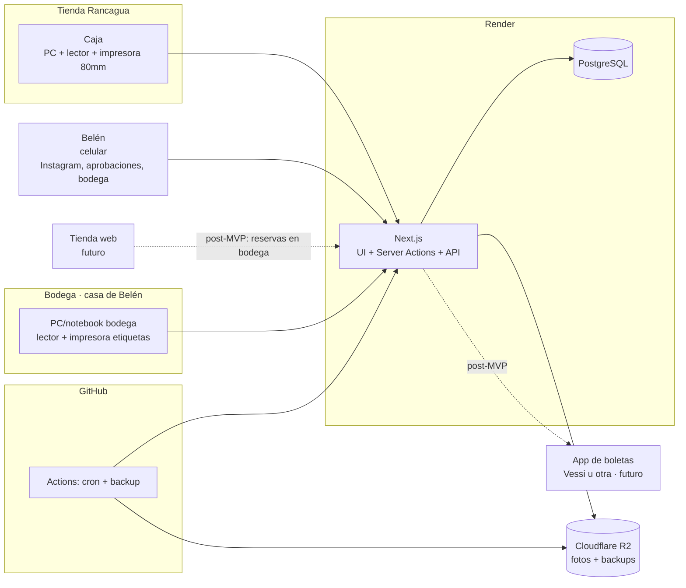
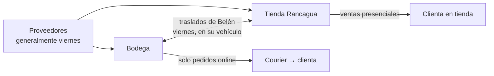
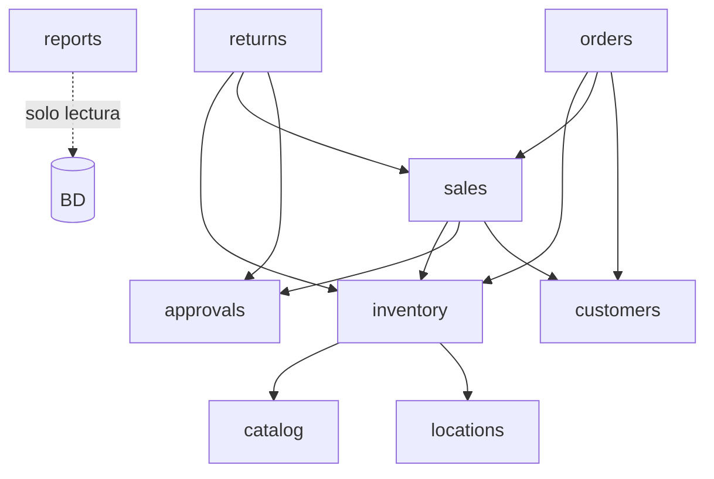
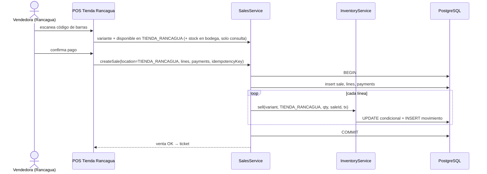
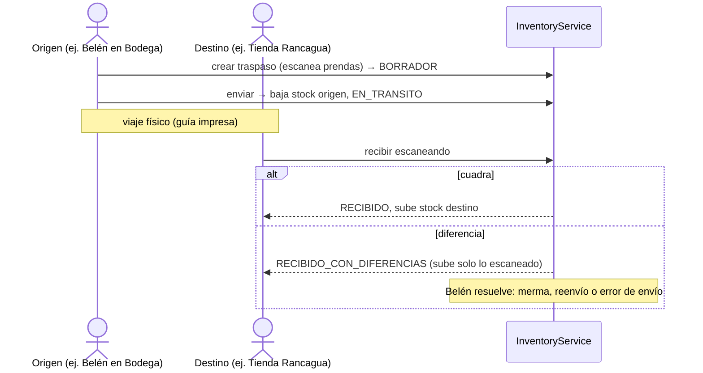

# 03 – Arquitectura

## 1. Principios

1. **Simple primero**: monolito modular, un repositorio, una base de datos. Nada de microservicios.
2. **El inventario es el corazón**: un solo servicio (`InventoryService`) es dueño del stock; todo lo demás le pide cambios.
3. **Ledger + saldo**: el stock es un saldo materializado que siempre cuadra con la suma de movimientos inmutables.
4. **Consistencia antes que disponibilidad**: preferimos rechazar una venta a vender una prenda que no existe.
5. **Stack "amigable con IA"**: tecnologías muy populares, tipadas y con buena documentación, para que Claude Code genere código correcto.
6. **Servicios gestionados**: nada de administrar servidores.

## 2. Stack recomendado

| Capa | Tecnología | Por qué |
|------|-----------|---------|
| Lenguaje | **TypeScript** (strict) en todo el stack | Un solo lenguaje; tipos que atrapan errores de la IA |
| Framework web | **Next.js** (App Router) + React | Front y back en un proyecto; Server Actions y Route Handlers |
| UI | **Tailwind CSS + shadcn/ui** | Componentes accesibles, la IA los domina |
| Base de datos | **PostgreSQL** gestionado (**Render Postgres**, plan pagado básico) | Transacciones ACID, constraints, backups incluidos en planes pagados |
| ORM / migraciones | **Prisma** | Esquema declarativo legible, migraciones versionadas, muy conocido por la IA |
| Validación | **Zod** | Mismo esquema para formularios y servidor |
| Autenticación | **Better Auth** (alternativa: Auth.js) con credenciales + PIN | Control total de roles; sin costo por usuario |
| Tablas / formularios | TanStack Table, React Hook Form | Listados grandes, filtros, formularios complejos |
| Gráficos (post-MVP) | Recharts | Dashboards |
| Códigos de barra | `bwip-js` (generación), lector USB HID (lectura = teclado) | Sin drivers |
| Impresión | CSS de impresión (ticket 80 mm, etiquetas) vía diálogo del navegador | Sin software extra en MVP |
| Excel | `exceljs` / `papaparse` | Import/export |
| Tests | **Vitest** (unit/integración con Postgres real vía Docker) + **Playwright** (E2E) | Críticos para inventario |
| Hosting app | **Render** – Web Service plan Starter (Next.js con `next start`) | Uso comercial permitido, costo fijo y bajo, deploy automático desde GitHub |
| Jobs programados | GitHub Actions `schedule` → endpoint protegido (vencimiento de solicitudes de aprobación, alertas de traslados) | Sin costo extra |
| Respaldo externo | GitHub Action diaria: `pg_dump` → almacenamiento gratuito (ej. Cloudflare R2, capa gratuita) | Copia fuera del proveedor |
| Fotos (deseable) | Cloudflare R2 (capa gratuita) | Bajo costo |
| Monitoreo | Sentry (plan gratuito) | Errores en producción |
| Repositorio / CI | GitHub + GitHub Actions | Lint, typecheck, tests en cada PR |

### 2.1 Costo estimado (ADR-010)

| Servicio | Plan | USD/mes aprox. |
|----------|------|:-------------:|
| Render Web Service | Starter | 7 |
| Render Postgres | Básico pagado | 6 |
| GitHub, Sentry, R2 | Gratuitos | 0 |
| **Total** | | **~13 USD ≈ $12.000–13.000 CLP** |

- **Vercel queda descartado para producción**: su plan gratuito (Hobby) es solo para uso personal y no comercial, y el plan Pro cuesta 20 USD por usuario al mes.
- Supabase gratuito no se recomienda para producción: no incluye backups descargables y el plan pagado supera el presupuesto.
- Render no tiene región en Sudamérica. La latencia desde Chile a EE.UU. (~150 ms) es aceptable para este POS.
- Alternativa más barata: Railway (Hobby, 5 USD incluidos en uso), con un costo menos predecible.
- Un proveedor de boletas electrónicas (P-04) tendría un costo adicional.
- Precios verificados en septiembre de 2026. Revisarlos antes de contratar.
- Con 3 ubicaciones el tráfico sigue siendo bajo. Hay que vigilar la memoria del plan Starter (512 MB) y, si no alcanza, evaluar un plan mayor (supera el presupuesto; se conversa con Belén).

## 3. Vista general



Flujo físico de mercadería:



## 4. Módulos (monolito modular)

```
src/
  app/                    # Rutas Next.js (solo UI y adaptadores)
    (admin)/...           # Backoffice (Belén)
    pos/...               # POS (por tienda)
    bodega/...            # Recepción, traspasos, picking, despacho
    pedidos/...           # Pedidos online
    aprobaciones/...      # Vista móvil de Belén
    api/                  # Route handlers (cron, futuras integraciones)
  modules/
    auth/                 # Usuarios, roles, PIN, ubicación asignada, permisos
    locations/            # Ubicaciones y su configuración
    catalog/              # Productos, variantes, tallas, colores, SKU, etiquetas
    inventory/            # ⭐ InventoryService: stock, movimientos, reservas, recepciones, conteos, TRASPASOS
    sales/                # Ventas POS, pagos, caja por tienda, anulaciones, pricing/promociones
    approvals/            # Solicitudes de autorización remota
    returns/              # Cambios, devoluciones, vales
    orders/               # Pedidos online (origen bodega, traspasos ligados, retiro en tienda)
    customers/            # Clientes
    suppliers/            # Proveedores
    reports/              # Consultas de lectura / vistas SQL
    billing/              # (futuro) SII / DTE
  lib/                    # db, money (CLP), dates (America/Santiago), errors, access (rol + ubicación)
  components/             # UI compartida (shadcn)
prisma/                   # schema.prisma, migraciones, seed
tests/                    # integración y E2E
docs/                     # estos documentos
```

Reglas de dependencia:

- `app/` solo llama a la API pública de `modules/*` (nunca a Prisma directamente).
- Cada módulo expone un `index.ts`. No se importan archivos internos de otro módulo.
- **Solo `inventory` escribe** en `stock_levels`, `inventory_movements`, `reservations` y `transfers`.
- `sales`, `returns` y `orders` llaman a `InventoryService` dentro de **la misma transacción**.
- `approvals` no ejecuta la acción: cuando Belén aprueba, el módulo solicitante (`sales`/`returns`) la ejecuta con el `approvalId` como credencial de un solo uso.



## 5. InventoryService (contrato)

Todas las operaciones reciben un `tx`, el `userId`, la **ubicación** y una referencia al documento de origen. Además, validan que el usuario tenga acceso a esa ubicación.

| Operación | Efecto en `físico` | Efecto en `reservado` | Movimiento |
|-----------|:------------------:|:---------------------:|------------|
| `receive(variant, loc, qty, ref)` | +qty | — | `RECEPCION` |
| `adjust(variant, loc, delta, reason)` | ±delta | — | `AJUSTE` |
| `sell(variant, loc, qty, saleId)` | −qty (valida disponible) | — | `VENTA_POS` |
| `returnToStock(variant, loc, qty, returnId)` | +qty | — | `DEVOLUCION` |
| `writeOff(variant, loc, qty, reason)` | −qty | — | `MERMA` |
| `reserve(variant, loc, qty, orderLineId, expiresAt?)` | — | +qty (valida disponible) | (registro en `reservations`) |
| `releaseReservation(reservationId, reason)` | — | −qty | (estado reserva) |
| `consumeReservation(reservationId)` (solo en BODEGA) | −qty | −qty | `VENTA_ONLINE` |
| `sendTransfer(transferId)` | −qty en origen (valida disponible; si la línea lleva `reservationId`, consume esa reserva) | −qty si hay reserva | `TRASPASO_SALIDA` |
| `receiveTransfer(transferId, scannedLines)` | +qty recibida en destino; si la línea está ligada a un pedido, **crea reserva firme** en destino | +qty si hay pedido | `TRASPASO_ENTRADA` |
| `resolveTransferDifference(transferId, resolution)` | según resolución (merma en origen / reingreso / reenvío) | — | `MERMA_TRASPASO` / `AJUSTE` |
| `applyCount(countId)` | ±diferencias en esa ubicación | — | `AJUSTE_CONTEO` |

**Stock en tránsito** = suma de las líneas de traspasos `EN_TRANSITO`. Se calcula, no se guarda en `stock_levels`, y la ubicación de origen es la responsable hasta la recepción.

### 5.1 Control de concurrencia

Nunca "leer, calcular y guardar". Se usa **update condicional atómico**:

```sql
UPDATE stock_levels
SET on_hand = on_hand - :qty, updated_at = now()
WHERE variant_id = :v AND location_id = :l
  AND on_hand - reserved >= :qty;       -- si afecta 0 filas → STOCK_INSUFICIENTE
```

Constraints en BD: `CHECK (on_hand >= 0)`, `CHECK (reserved >= 0)`, `CHECK (reserved <= on_hand)`.
Multi-línea: una sola transacción, variantes ordenadas por (location_id, variant_id) para evitar deadlocks.

### 5.2 Idempotencia

Ventas, pedidos, traspasos (enviar/recibir), recepciones y aprobaciones llevan `idempotencyKey` único.

## 6. Flujos críticos

### 6.1 Venta en POS (por tienda)



### 6.2 Pedido online (origen bodega, se aparta al pagar)

1. **Registro (Belén)**: crea el pedido con sus líneas. El sistema muestra el disponible en BODEGA y en la tienda, pero **no reserva nada** → `PENDIENTE_PAGO`.
2. **Pago confirmado** (una sola transacción):
   - `reserve()` en BODEGA por cada línea. Si bodega no tiene disponible, Belén elige apartarla en la tienda → `reserve()` en TIENDA_RANCAGUA (línea con `source_location`). Si ya no hay stock en ninguna, la confirmación falla y se informa qué prenda falta.
   - Se crea la `Sale` canal INSTAGRAM (ubicación contable: BODEGA).
   - Por las líneas apartadas en la tienda se crea un **traslado tienda → bodega** ligado al pedido.
   - → `ESPERANDO_TRASPASO` o `LISTO_PARA_PREPARAR`.
3. **La tienda envía el traslado** (o Belén lo retira el viernes) → `sendTransfer()` consume la reserva de la tienda y baja su físico.
4. **La bodega recibe** → `receiveTransfer()` sube el físico de bodega y crea la reserva firme para la línea. Cuando todo está reservado en bodega → `LISTO_PARA_PREPARAR`.
5. **Picking en bodega (Belén)** → `consumeReservation()` → `PREPARADO`.
6. **Entrega**: despacho por courier → `DESPACHADO` → `ENTREGADO`. Retiro: por definir (P-11).
7. **Sin reservas que venzan**: como se aparta recién al pagar, no hay reservas por vencer. Un pedido impago se cancela manualmente.

### 6.3 Traslado entre tienda y bodega



### 6.4 Autorización remota

1. La vendedora pide un descuento o un reembolso → `approvals.request({type, locationId, payload})` → `PENDIENTE`. Como solo Belén da descuentos, este flujo será frecuente.
2. Belén ve la solicitud en `/aprobaciones` (vista móvil; en el MVP se actualiza cada ~3 s, y las notificaciones push son deseables). Aprueba o rechaza.
3. El POS (que consulta el estado) continúa: `returns.refund(..., approvalId)`. El servicio verifica que la aprobación esté `APROBADA`, que coincida con el tipo, la ubicación y el monto, y que no se haya usado antes. Luego la marca `USADA`.
4. Si pasan X minutos sin respuesta → `VENCIDA`.
5. Alternativa presencial: PIN de Belén en el mismo equipo (queda como aprobación con método `PIN`).

### 6.5 Cambio en la tienda

Una sola transacción: `returnToStock(loc = TIENDA_RANCAGUA)` (o `writeOff()`) + `sell(loc = TIENDA_RANCAGUA)` + diferencia. La validación "no devolver más de lo vendido" se hace contra la venta original (de la tienda o de un pedido online). Reglas de plazo y reembolso por validar (P-09).

## 7. Dinero e impuestos

- `Int` CLP en BD y TS; `lib/money.ts`. Descuentos % en puntos básicos.
- Precios con IVA incluido. Las ofertas pueden ser **solo online o de ambos canales**. Neto e IVA solo al emitir documento.
- Redondeo del efectivo a $10 (Ley 20.956): `rounding_adjustment` en la venta.
- Promociones en `sales/pricing.ts` (función pura), iguales en POS y online.
- La tienda tiene **una caja compartida** por las vendedoras; cada venta registra la vendedora. Los reembolsos en efectivo salen de esa caja.

## 8. Seguridad y acceso por ubicación

- Cada Server Action valida **rol + ubicación**: `requireAccess({ roles: ['VENDEDORA'], locationId })`. Vendedora y Bodega solo operan en su `location_id` asignada; Admin en todas.
- Consultar el stock de otras ubicaciones es una acción de solo lectura, separada.
- Dispositivo POS registrado a la tienda; las vendedoras se identifican con su PIN en la caja compartida.
- Acciones sensibles → aprobación de Belén (remota o con PIN) + `audit_log`.
- Secretos en Render y GitHub Secrets.

## 9. Ambientes y despliegue

| Ambiente | Uso | BD |
|----------|-----|----|
| Local | Desarrollo con Claude Code | Postgres en Docker (seed con tienda + bodega) |
| Staging | Pruebas con Belén y vendedoras | Render gratuito (con sus límites) |
| Producción | Operación | Render pagado + backups del proveedor + `pg_dump` diario externo |

Pipeline: rama `feature/*` → PR a `develop` → GitHub Actions (lint, typecheck, tests) → staging → promoción manual a producción. `main` se reserva para las entregas del curso. Migraciones revisadas por una persona.

## 10. Contingencia (sin internet)

POS online-only (ADR-005). Rancagua tiene fibra estable; bodega por confirmar (P-20). Plan B:
1. Internet compartido desde un celular.
2. Si no hay sistema: planilla de contingencia. Al volver, se registran como "ventas de contingencia" (que descuentan stock) y los traslados se registran con su fecha real.

## 11. Preparado para el futuro

- **Tienda web**: reservará sobre BODEGA con las mismas operaciones.
- **Boletas**: módulo `billing` con interfaz `DocumentProvider`, para integrar su app de boletas (Vessi u otra) si ofrece API.
- **Reposición sugerida**: stock mínimo por (variante, ubicación) → sugerencias de traslado.
- **Segunda tienda**: el modelo multi-ubicación ya lo soporta (ubicaciones, traslados, permisos por ubicación).
