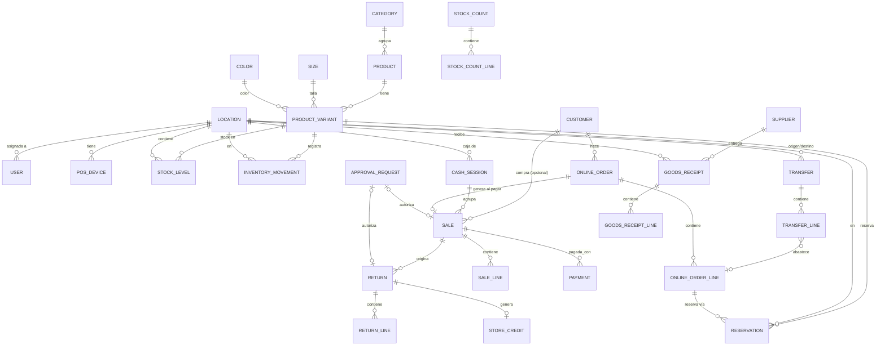

# 04 – Modelo de datos (v0.4 – tienda + bodega, multi-ubicación)

Convenciones: tablas en `snake_case` plural; PK `id` (UUID v7 o cuid); timestamps `created_at`/`updated_at` en UTC; montos `Int` CLP; cantidades `Int`; soft delete con `active boolean` (no `DELETE`).

## 1. Diagrama entidad-relación (núcleo)

## 2. Entidades

### 2.1 Usuarios, ubicaciones, dispositivos

**locations**: `id`, `code` (único: `TIENDA_RANCAGUA`, `BODEGA`; el modelo admite más), `name`, `type` (`STORE` | `WAREHOUSE`), `address`, `sells_pos` (bool), `fulfills_online` (bool; solo BODEGA = true), `receives_suppliers` (bool; ambas = true), `sale_prefix` (`RGA`, `BOD`), `sii_branch_code` (nullable, futuro), `active`.

**users**: `id`, `name`, `email` (único, nullable para vendedoras solo-PIN), `password_hash` (nullable), `pin_hash`, `role` (`ADMIN` | `VENDEDORA` | `BODEGA`), `location_id` (**obligatorio para VENDEDORA y BODEGA**; null para ADMIN), `active`, `failed_pin_attempts`, `locked_until`.
- Constraint: `role = 'ADMIN' OR location_id IS NOT NULL`.

**pos_devices**: `id`, `location_id`, `name` ("Caja Tienda Rancagua"), `device_token_hash`, `registered_by`, `active`. La sesión POS queda ligada a la tienda del dispositivo.

### 2.2 Catálogo (sin cambios de fondo)

**categories**: `id`, `name`, `parent_id` (nullable), `active`.
**sizes**: `id`, `code` (`S`, `44`, `3XL`…), `sort_order`, `active`.
**colors**: `id`, `code` (`NEG`), `name` (`Negro`), `hex` (opcional), `active`.

**products**: `id`, `model_code` (único), `name`, `description`, `category_id`, `base_price` (IVA incl., igual en todos los canales; las ofertas van en `promotions`), `base_cost`, `low_stock_threshold`, `images` (json, opcional), `active`.

**product_variants**: `id`, `product_id`, `size_id`, `color_id`, `sku` (único), `barcode` (único), `barcode_source` (`PROVEEDOR` | `INTERNO`), `price_override`, `cost_override`, `active`. Único (`product_id`, `size_id`, `color_id`).

**price_history**: `id`, `product_id`, `variant_id`, `old_price`, `new_price`, `user_id`, `created_at`.

**promotions** / **promotion_targets**: `type` (`PORCENTAJE` | `MONTO`), `value`, `scope` (`PRODUCTO` | `VARIANTE` | `CATEGORIA`), `starts_at`, `ends_at`, `channels` (POS / online / ambos). Pueden aplicar **solo online o a ambos canales** (RN-05 ✅). Regla de combinación: RN-20 🟡.

### 2.3 Inventario ⭐

**stock_levels** (PK `variant_id` + `location_id`): `on_hand`, `reserved`, `updated_at`.
- `CHECK (on_hand >= 0)`, `CHECK (reserved >= 0)`, `CHECK (reserved <= on_hand)`.
- `available = on_hand − reserved` (calculado).
- Se crea la fila al primer movimiento (o para todas las ubicaciones al crear la variante, con 0).

**inventory_movements** (solo INSERT): `id`, `variant_id`, `location_id`, `type`, `quantity` (±), `on_hand_after`, `unit_cost`, `reason`, `ref_type` (`SALE`, `RETURN`, `ONLINE_ORDER`, `GOODS_RECEIPT`, `STOCK_COUNT`, `TRANSFER`, `MANUAL`), `ref_id`, `user_id`, `idempotency_key`, `created_at`.
- Tipos: `CARGA_INICIAL`, `RECEPCION`, `VENTA_POS`, `VENTA_ONLINE`, `DEVOLUCION`, `ANULACION_VENTA`, `AJUSTE`, `AJUSTE_CONTEO`, `MERMA`, `TRASPASO_SALIDA`, `TRASPASO_ENTRADA`, `MERMA_TRASPASO`, `REINGRESO_PEDIDO_CANCELADO`, `VENTA_CONTINGENCIA`.
- Invariante: `SUM(quantity)` por (variante, ubicación) = `on_hand`.

**reservations**: `id`, `variant_id`, `location_id`, `quantity`, `status` (`ACTIVA` | `CONSUMIDA` | `LIBERADA` | `VENCIDA` | `TRASPASADA`), `order_line_id`, `expires_at` (null = firme; con la regla "se aparta al pagar" (RN-07) todas las reservas nacen firmes), `transfer_line_id` (nullable: si la reserva salió en un traspaso), `created_by`, `released_reason`, `created_at`, `closed_at`.
- `TRASPASADA`: la reserva de una tienda se consumió al enviar el traspaso a bodega; en bodega nace una reserva nueva para la misma línea al recibirlo.
- Invariante: `SUM(quantity WHERE ACTIVA)` por (variante, ubicación) = `reserved`.

**transfers**: `id`, `number` (`TR-000123`), `from_location_id`, `to_location_id` (≠ origen), `status` (`BORRADOR` | `EN_TRANSITO` | `RECIBIDO` | `RECIBIDO_CON_DIFERENCIAS` | `CERRADO` | `ANULADO`), `reason` (`REPOSICION` | `PEDIDO_ONLINE` | `DEVOLUCION_A_BODEGA` | `OTRO`), `online_order_id` (nullable), `created_by`, `sent_by`, `sent_at`, `received_by`, `received_at`, `resolved_by`, `resolved_at`, `resolution_notes`, `idempotency_key`.

**transfer_lines**: `id`, `transfer_id`, `variant_id`, `qty_sent`, `qty_received` (null hasta recibir), `order_line_id` (nullable), `reservation_id` (nullable: reserva en origen que se consume al enviar), `difference_resolution` (`MERMA` | `REENVIO` | `ERROR_ENVIO` | null).
- En tránsito (por variante y ubicación de origen) = `SUM(qty_sent)` de las líneas con traspaso `EN_TRANSITO`.

**goods_receipts**: `id`, `location_id` (bodega o tienda), `supplier_id` (nullable), `supplier_doc_number`, `status` (`PENDIENTE_COSTO` | `COMPLETA`), `received_by`, `costed_by`, `received_at`, `notes`.
**goods_receipt_lines**: `id`, `receipt_id`, `variant_id`, `quantity`, `unit_cost` (nullable hasta que Belén lo completa).
- El stock sube al registrar las cantidades; el costo se completa después (afecta valorización y margen, no el stock).

**stock_counts** / **stock_count_lines**: por `location_id`; `scope`, `status` (`ABIERTO` | `EN_REVISION` | `APLICADO` | `ANULADO`), `started_by`, `approved_by` (siempre ADMIN) / `variant_id`, `expected_qty`, `counted_qty`, `difference`.

### 2.4 Ventas, caja y aprobaciones

**cash_sessions** (caja compartida de la tienda): `id`, `location_id` (tienda), `pos_device_id`, `opened_by`, `opened_at`, `opening_cash`, `closed_by`, `closed_at`, `expected_cash`, `counted_cash`, `difference`, `notes`, `status`.

**cash_movements** (D): `id`, `cash_session_id`, `type`, `amount`, `reason`, `user_id`.

**sales**: `id`, `number` (`{prefijo}-{correlativo}` por ubicación, ej. `RGA-000045`), `channel` (`POS` | `INSTAGRAM` | `WHATSAPP` | `WEB`), `location_id` (tienda para POS; BODEGA para online), `cash_session_id` (null en online), `seller_id`, `customer_id`, `online_order_id`, `status` (`COMPLETADA` | `ANULADA`), `subtotal`, `discount_total`, `total`, `rounding_adjustment`, `tax_doc_type`, `tax_doc_number`, `is_contingency`, `idempotency_key`, `created_at`, `voided_at`, `voided_by`, `void_approval_id`.

**sale_lines**: `id`, `sale_id`, `variant_id`, `quantity`, `unit_price`, `unit_cost`, `promotion_id`, `promotion_discount`, `manual_discount`, `discount_approval_id` (nullable), `line_total`.

**payments**: `id`, `sale_id`, `method`, `amount`, `reference`, `created_at`. Invariante: `SUM(amount) = total + rounding_adjustment`.

**approval_requests**: `id`, `type` (`REEMBOLSO` | `ANULACION` | `DESCUENTO_SOBRE_LIMITE` | `CAMBIO_FUERA_PLAZO` | `CAMBIO_SIN_BOLETA`), `location_id`, `requested_by`, `payload` (json: venta, monto, %, motivo), `amount` (Int, nullable), `status` (`PENDIENTE` | `APROBADA` | `RECHAZADA` | `VENCIDA` | `USADA`), `method` (`REMOTA` | `PIN`), `decided_by`, `decided_at`, `decision_comment`, `expires_at`, `used_at`, `used_ref_type`, `used_ref_id`, `created_at`.
- Una aprobación se usa **una sola vez** y solo para la acción, la ubicación y el monto aprobados.

### 2.5 Cambios, devoluciones, vales

**returns**: `id`, `location_id` (**tienda o bodega donde se procesa**), `original_sale_id` (de cualquier ubicación), `type` (`CAMBIO` | `DEVOLUCION`), `reason`, `refund_method` (`EFECTIVO` | `TRANSFERENCIA` | `ANULACION_TRANSBANK` | `VALE` | `NINGUNO`), `refund_amount`, `refund_reference`, `approval_id` (obligatorio si hay reembolso de dinero), `cash_session_id` (si el reembolso fue en efectivo), `new_sale_id`, `user_id`, `created_at`.

**return_lines**: `id`, `return_id`, `sale_line_id`, `variant_id`, `quantity`, `amount`, `condition` (`VENDIBLE` | `DANADA`). La prenda entra al stock de `returns.location_id`.

**store_credits**: `id`, `code`, `customer_id`, `origin_return_id`, `issued_location_id`, `initial_amount`, `balance`, `expires_at` (3 meses), `status`. Se usan en la tienda y online.

### 2.6 Pedidos online

**customers**: `id`, `name`, `instagram_handle`, `phone`, `email`, `rut` (nullable), `notes`, `active`.
**customer_addresses**: `id`, `customer_id`, `street`, `number`, `apartment`, `commune`, `region`, `reference`.

**online_orders**: `id`, `number`, `channel`, `customer_id`, `status` (`PENDIENTE_PAGO` | `PAGADO` | `ESPERANDO_TRASPASO` | `LISTO_PARA_PREPARAR` | `PREPARADO` | `DESPACHADO` | `EN_CAMINO_A_TIENDA` | `LISTO_PARA_RETIRO` | `ENTREGADO` | `CANCELADO`), `fulfillment_location_id` (= BODEGA), `delivery_method` (`DESPACHO` | `RETIRO_TIENDA`), `pickup_location_id` (tienda de retiro, nullable), `shipping_address`, `shipping_cost`, `free_shipping_applied`, `subtotal`, `discount_total`, `total`, `payment_method`, `payment_reference`, `paid_at`, `prepared_at`, `prepared_by`, `courier`, `tracking_number`, `shipped_at`, `arrived_at_store_at`, `store_received_by`, `delivered_at`, `delivered_by`, `picked_up_by_name` / `picked_up_by_rut`, `cancelled_at`, `cancel_reason`, `sale_id`, `created_by` (ADMIN), `idempotency_key`, `notes`.

**online_order_lines**: `id`, `order_id`, `variant_id`, `quantity`, `unit_price`, `promotion_id`, `discount_amount`, `line_total`, `source_location_id` (BODEGA o la tienda de donde se trae), `picked_qty`.

### 2.7 Proveedores

**suppliers**: `id`, `legal_name`, `rut`, `contact_name`, `phone`, `email`, `notes`, `active`. (Post-MVP: `purchase_orders`.)

### 2.8 Auditoría y configuración

**audit_log**: `id`, `user_id`, `location_id`, `action`, `entity`, `entity_id`, `before`, `after`, `created_at`.

**settings** (editables por Belén): `max_seller_discount_bps` (**0** ✅: solo Belén da descuentos), `return_window_days` (30), `store_credit_validity_days` (90), `free_shipping_threshold`, `couriers`, `approval_timeout_minutes` (10 🟡), `transfer_transit_alert_days` (3 🟡).

**stock_min_levels** (post-MVP): `variant_id`, `location_id`, `min_qty`, `target_qty` → sugerencias de reposición.

## 3. Índices clave

- `product_variants(barcode)`, `(sku)` únicos.
- `stock_levels(location_id, variant_id)`.
- `inventory_movements(variant_id, location_id, created_at)`.
- `reservations(status, expires_at)`, `reservations(order_line_id)`.
- `transfers(status, to_location_id)`, `transfers(status, from_location_id)` → bandejas "por enviar" y "por recibir".
- `approval_requests(status, created_at)`.
- `sales(location_id, created_at)`, `sales(channel, created_at)`.
- `online_orders(status, created_at)`, `online_orders(pickup_location_id, status)`.

## 4. Vistas de reporte

- `v_stock_matrix` (variante × Tienda Rancagua / Bodega / En tránsito / Total).
- `v_sales_daily` (fecha Chile, ubicación, canal, vendedora, unidades, total, margen).
- `v_product_performance` (por variante y canal: vendidas 7/30/90 días, stock, días de inventario) → base para reposición y traslados tienda ↔ bodega.
