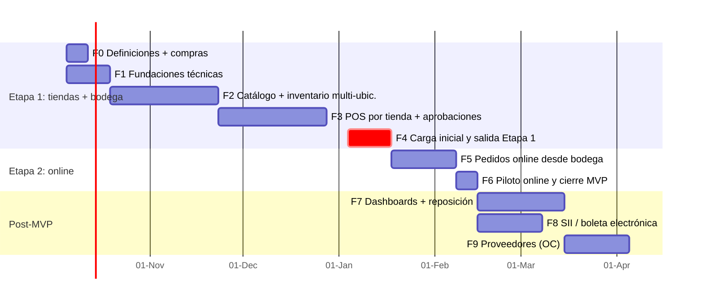

# 05 – Plan de trabajo (v0.3 – 2 tiendas + bodega)

Supuesto de capacidad: **1 desarrollador ~20 h/semana con Claude Code**. Si es jornada completa, dividir los plazos por ~1,7.

## 1. Qué cambió respecto a v0.2

- De 1 a **3 ubicaciones** → traspasos con tránsito, recepción en cualquier ubicación, caja por tienda y permisos por ubicación pasan a ser **MVP**.
- Nuevo **rol Bodega** y **aprobaciones remotas** de Belén.
- Pedidos online **desde bodega**, con traspasos tienda → bodega y retiro en tienda.
- **Salida a producción en 2 etapas** para no esperar a tener todo el MVP (Providencia ya está operando sin sistema).
- Esfuerzo total: **+3 a 4 semanas**.

## 2. Hoja de ruta

| Hito | Fecha estimada | Rango |
|------|----------------|-------|
| **Etapa 1 en producción** (inventario de las 3 ubicaciones, traspasos y POS en ambas tiendas) | ~15 enero 2027 | 10–14 semanas desde el inicio |
| **MVP completo** (pedidos online desde bodega) | ~8 febrero 2027 | 14–19 semanas |

> **No salir a producción en la segunda quincena de diciembre** (temporada alta de Navidad). Si F3 termina antes, se usa diciembre para pruebas con las vendedoras en staging y la salida se hace la primera semana de enero, con el conteo en un fin de semana.

## 3. Fases

### F0 – Definiciones y compras (1 semana, en paralelo con F1)
- **Contador: P-04 (boletas).** Con dos tiendas es aún más relevante: cada una es una sucursal.
- Belén: P-05, P-08, P-11, P-16 a P-22 (doc 07).
- Listas maestras de tallas y colores.
- **Hardware** (hay PC en las 3 ubicaciones):

| Ubicación | Comprar |
|-----------|---------|
| Tienda Rancagua | Lector de códigos USB, impresora térmica 80 mm |
| Tienda Providencia | Lector de códigos USB, impresora térmica 80 mm |
| Bodega | Lector (idealmente inalámbrico), impresora de etiquetas adhesivas |
| Tiendas (opcional) | Impresora de etiquetas, solo si reciben directo prendas **sin** código de proveedor (P-21) |

### F1 – Fundaciones técnicas (1–2 semanas)
- Repo, Next.js + TS, Tailwind/shadcn, Prisma, Docker, CI, Render staging, Sentry, backups.
- **Ubicaciones y acceso**: tabla `locations`, roles ADMIN/VENDEDORA/BODEGA, usuario con ubicación asignada, `requireAccess(rol, ubicación)`, dispositivos POS por tienda.
- `lib/money.ts`, `lib/dates.ts` con tests.
**Aceptación:** una vendedora de Providencia no puede ejecutar nada en Rancagua (test automático).

### F2 – Catálogo e inventario multi-ubicación (4–5 semanas)
- Catálogo, variantes, SKU/códigos, etiquetas, importación Excel.
- `InventoryService` completo con tests de concurrencia.
- **Recepción de proveedor en cualquier ubicación** (costo pendiente → Belén completa).
- **Traspasos**: crear, enviar, recibir escaneando, diferencias, resolución, alerta de tránsito, guía imprimible.
- Conteos por ubicación; kardex; **matriz de stock** (variante × ubicación + tránsito).
**Aceptación:** recibir mercadería en bodega, traspasar a Providencia con una prenda faltante, recibir con diferencia, que Belén la resuelva y que el kardex cuadre en las 3 ubicaciones.

### F3 – POS por tienda, aprobaciones y cambios (4–5 semanas)
- POS por tienda, caja por tienda, descuentos, promociones, redondeo, pagos mixtos, ticket con datos de la tienda.
- **Aprobaciones remotas** (vista móvil de Belén, vencimiento, uso único, PIN presencial).
- Cambios y devoluciones **en cualquier tienda**; vales usables en ambas tiendas.
- **Venta online rápida (transitoria)**: pantalla para que Belén registre una venta de Instagram que descuenta directo de BODEGA (sin reservas). Mantiene correcto el stock de bodega entre la Etapa 1 y la Etapa 2.
- Reportes por tienda y consolidados; cierre de caja.
**Aceptación:** simular un día en las dos tiendas en paralelo (ventas, un cambio cruzado, un reembolso aprobado desde el celular, cierre de ambas cajas).

### F4 – Carga inicial y salida Etapa 1 (2 semanas)
- Producción en Render + restauración de backup probada.
- **Etiquetado y conteo de las 3 ubicaciones el mismo fin de semana** (sin traspasos en curso) → carga inicial.
- Capacitación por rol: vendedoras (POS, traspasos, recepción), bodega (recepción, traspasos, etiquetas), Belén (todo + aprobaciones).
- Soporte diario la primera semana.
**Aceptación:** una semana operando las 3 ubicaciones solo con el sistema; diferencia de conteo de control < 2 % por ubicación.

### F5 – Pedidos online desde bodega (3 semanas)
- Registro por Belén, reservas en bodega o en tienda, vencimiento, confirmación de pago.
- Traspasos automáticos tienda → bodega ligados al pedido.
- Picking en bodega, despacho, **retiro en tienda** (envío interno, llegada, entrega).
- Tablero por estado.
**Aceptación:** pedido con 2 prendas (una en bodega y otra en Rancagua) → pago → traspaso → picking → retiro en Providencia. Una prenda reservada no se puede vender en el POS de Rancagua.

### F6 – Piloto online y cierre del MVP (1 semana)
- Pasar de la "venta online rápida" al flujo completo. Ajustes.

### Post-MVP
- **F7**: dashboards por tienda y consolidados + **reposición sugerida bodega → tiendas** (stock mínimo por tienda).
- **F8**: SII (boleta por sucursal, nota de crédito). ⚠️ Puede adelantarse (R-02).
- **F9**: órdenes de compra a proveedores.
- **F10**: tienda web conectada a bodega.

## 4. Definición de "Terminado"

- [ ] Cumple los RF/RN referenciados.
- [ ] Tests pasan; en inventario, traspasos, ventas y pedidos se incluyen bordes y concurrencia.
- [ ] **Permisos por rol y ubicación probados** (un test de acceso cruzado por cada acción nueva).
- [ ] Lint + typecheck; CI verde.
- [ ] Revisado en staging; flujos revisados por Belén cuando aplique.
- [ ] Docs actualizados.

## 5. Riesgos

| ID | Riesgo | Prob. | Impacto | Mitigación |
|----|--------|:----:|:-------:|------------|
| R-01 | No hay datos previos: catálogo y stock desde cero en 3 ubicaciones | Alta | Alto | Plantilla Excel + etiquetado y conteo simultáneo en F4 |
| R-02 | Obligación SII (efectivo/transferencia requieren boleta), ahora en 2 sucursales | Alta | Alto | Contador ya (P-04); adelantar F8 si hace falta |
| R-04 | Caída de internet en alguna ubicación | Media | Alto | Confirmar conexión en Providencia y bodega (P-20) + internet del celular + contingencia |
| R-05 | Baja adopción | Media | Alto | Involucrar a vendedoras y bodega en las pruebas de F3; capacitación por rol |
| R-06 | Errores de la IA en stock o dinero | Media | Alto | CLAUDE.md, tests obligatorios, revisión humana |
| R-07 | Crecimiento de alcance | Alta | Medio | Etapas cerradas; nuevas ideas al backlog |
| R-08 | Reservas no pagadas bloquean stock (incluso en tiendas) | Media | Medio | Vencimiento automático + tablero |
| R-09 | Dependencia de un solo desarrollador | Alta | Alto | Docs vivos, specs por feature |
| R-10 | Presupuesto mínimo | Media | Medio | Render ~13 USD/mes; vigilar la memoria; cotizar el proveedor de boletas |
| R-11 | Hardware no llega a tiempo | Media | Medio | Comprar en F0 |
| R-12 | **Complejidad multi-ubicación** (traspasos + reservas + pedidos) | Media | Alto | Diseño explícito en doc 03, tests de flujo completo (F5), salida por etapas |
| R-13 | **Traspasos sin confirmar** (stock "perdido" en tránsito) | Media | Medio | Alerta de tránsito > X días; reporte de traspasos abiertos; la recepción escaneada es obligatoria |
| R-14 | **Belén es cuello de botella** (Instagram, aprobaciones, costos, diferencias) | Alta | Medio | Límites configurables (ej. descuento de vendedora > 0 %), vencimiento de solicitudes, evaluar un rol "encargada de tienda" más adelante |
| R-15 | Salir a producción en temporada alta | Media | Alto | No salir la segunda quincena de diciembre; salir la primera semana de enero |
| R-16 | Stock de bodega descuadrado entre la Etapa 1 y la 2 (ventas online manuales) | Media | Medio | "Venta online rápida" en F3, obligatoria para Belén |
