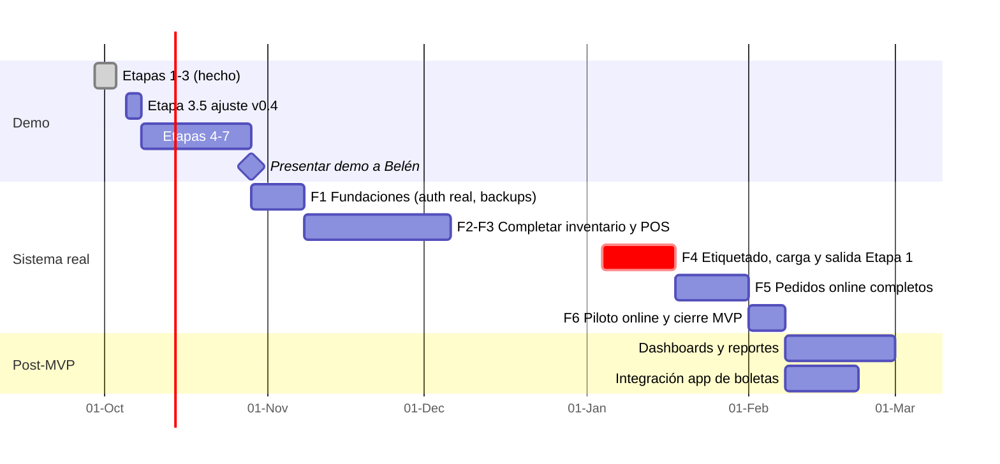

# 05 – Plan de trabajo (v0.4 – 1 tienda + bodega)

Supuesto de capacidad: **1 desarrollador ~20 h/semana con Claude Code** (más el apoyo del Equipo 10).

## 1. Qué cambió respecto a v0.3 (reunión del 2026-10-02)

- **Una sola tienda (Rancagua)** + bodega (casa de Belén). Se elimina Providencia: un solo POS y una sola caja (compartida).
- **Belén opera la bodega** con su rol Admin; el rol Bodega queda para el futuro.
- **Los pedidos online se apartan al pagar**: no hay reservas por vencer (más simple).
- **Solo Belén da descuentos**: las aprobaciones remotas pasan a ser centrales en el POS.
- **Se etiqueta toda la ropa** (solo los jeans traen código): la impresora de etiquetas y el etiquetado inicial son críticos.
- **Boletas**: ya las emiten con una app (probablemente Vessi). En el MVP el POS registra el N° de boleta; baja el riesgo tributario.
- Esfuerzo: **−1 a 2 semanas** respecto a v0.3.

## 2. Estado actual (demo funcional, rama `feature/demo`)

| Etapa de la demo | Estado |
|------------------|--------|
| 1. Base, login de demo, datos de ejemplo | ✅ |
| 2. InventoryService (concurrencia), stock y kardex | ✅ |
| 3. Identidad visual y POS (caja, ticket, ventas del día) | ✅ |
| 3.5 Ajuste a v0.4 (sin Providencia, descuento 0 %, reserva al pagar) | ⏳ Siguiente |
| 4. Traslados tienda ↔ bodega | Pendiente |
| 5. Pedidos online desde bodega | Pendiente |
| 6. Aprobaciones remotas de Belén | Pendiente |
| 7. Pulido y publicación | Pendiente |

## 3. Hoja de ruta

| Hito | Fecha estimada |
|------|----------------|
| Demo completa presentada a Belén | ~fines de octubre 2026 |
| **Etapa 1 en producción** (tienda + bodega, traslados, POS, aprobaciones) | ~mediados de enero 2027 |
| **MVP completo** (pedidos online desde bodega) | ~inicios de febrero 2027 |

> No salir a producción en la segunda quincena de diciembre (temporada alta). Fechas por confirmar con Belén y con el calendario del curso.

## 4. Fases

### Demo (octubre)
- **3.5 Ajuste a v0.4**: quitar Providencia del seed y de los tests, límite de descuento de la vendedora en 0 %, regla "se aparta al pagar" para la Etapa 5.
- **4 Traslados**: envío y recepción entre tienda y bodega, diferencias.
- **5 Pedidos online**: registro sin reserva → pago (aparta en bodega o en tienda + traslado) → picking → despacho.
- **6 Aprobaciones**: descuentos, reembolsos y anulaciones desde el celular de Belén o con su PIN.
- **7 Pulido y publicación** en Render para mostrarla.

### F1 – Fundaciones del sistema real
Autenticación real (Belén con contraseña, vendedoras con PIN), backups, staging, permisos de BD de producción.

### F2–F3 – Completar inventario y POS
Importación desde el Excel actual, impresión de etiquetas, conteos, cambios y devoluciones (según las reglas que confirme Belén), promociones por canal, reportes por medio de pago.

### F4 – Etiquetado, carga inicial y salida de la Etapa 1
- **Etiquetar toda la ropa** que no tenga código (tienda y bodega): es el trabajo más grande de la salida. Planificarlo con Belén por categorías, en las semanas previas.
- Conteo final y carga inicial en ambas ubicaciones.
- Capacitación a vendedoras (POS, caja, recepción) y a Belén (todo + aprobaciones).

### F5–F6 – Pedidos online completos y piloto

## 5. Hardware

| Ubicación | Necesita | Estado |
|-----------|----------|--------|
| Tienda Rancagua | PC (hay), lector USB, impresora térmica 80 mm, **impresora de etiquetas** (reciben proveedores directo) | Comprar lector e impresoras |
| Bodega (casa de Belén) | PC/notebook (❓ P-20), lector, **impresora de etiquetas** | Por confirmar |
| Belén | Celular (aprobaciones) | ✅ |

Alternativa para ahorrar: una sola impresora de etiquetas en la tienda, y Belén etiqueta allí lo que va a la bodega antes del traslado de los viernes.

## 6. Definición de "Terminado"

- [ ] Cumple los RF/RN referenciados.
- [ ] Tests pasan (inventario, traslados, ventas y pedidos con bordes y concurrencia).
- [ ] Permisos por rol y ubicación probados.
- [ ] Lint + typecheck; CI verde.
- [ ] Revisado en el navegador; flujos validados con Belén cuando aplique.
- [ ] Docs actualizados.

## 7. Riesgos

| ID | Riesgo | Prob. | Impacto | Mitigación |
|----|--------|:----:|:-------:|------------|
| R-01 | Carga inicial desde un Excel manual, y **etiquetado de casi toda la ropa** | Alta | Alto | Pedir el Excel ya; plantilla de importación; etiquetado por categorías antes de la salida |
| R-02 | Boletas: hoy se emiten con una app aparte → doble digitación | Media | Medio | En el MVP se registra el N° de boleta; evaluar la integración con Vessi después |
| R-04 | Internet en la bodega | Media | Medio | Confirmar (P-20); la bodega solo prepara pedidos, puede operar desde el celular |
| R-05 | Baja adopción | Media | Alto | Involucrar a las vendedoras en las pruebas; POS rápido |
| R-06 | Errores de la IA en stock o dinero | Media | Alto | CLAUDE.md, tests obligatorios, revisión humana |
| R-07 | Crecimiento de alcance | Alta | Medio | Etapas cerradas; backlog post-MVP |
| R-09 | Dependencia de un solo desarrollador | Alta | Alto | Docs vivos; repartir tareas en el equipo |
| R-10 | Presupuesto mínimo | Media | Medio | Render ~13 USD/mes |
| R-11 | Hardware no llega a tiempo | Media | Medio | Comprar antes de F4 |
| R-13 | Traslados sin confirmar | Media | Medio | Alerta de tránsito; recepción escaneada obligatoria |
| R-14 | **Belén concentra todo** (Instagram, bodega, traslados, todos los descuentos y aprobaciones) | **Alta** | Alto | Aprobación en un toque desde el celular; promociones configuradas de antemano (no requieren aprobación); a futuro, delegar un límite pequeño a las vendedoras |
| R-15 | Salir a producción en temporada alta | Media | Alto | Salir la primera semana de enero |
| R-17 | Pedidos online pagados sin stock (se aparta recién al pagar) | Media | Medio | Al registrar se muestra el disponible; al pagar se valida y se avisa si falta |
