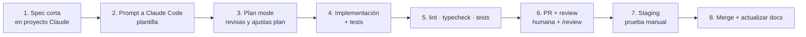

# 06 – Desarrollo con IA

## 1. Herramientas y rol de cada una

| Herramienta | Rol |
|-------------|-----|
| **Proyecto Claude "Big Curvas – Arquitectura"** | Arquitecto/analista: specs, decisiones (ADR), revisión de diseño, redacción de prompts para Claude Code. Tiene estos docs como conocimiento |
| **Claude Code** (terminal o extensión VS Code) | Implementa en el repo: código, tests, migraciones, refactors. Lee `CLAUDE.md` y `/docs` |
| **VS Code** | Revisar diffs, navegar código, depurar |
| **GitHub** | Código fuente, PRs, issues (backlog), Actions (CI) |
| **Render** | Staging (gratuito) y producción (pagado), con app y PostgreSQL |
| **Sentry** | Errores en producción |

Regla de oro: **la IA propone, tú decides**. Nada llega a `main` sin que hayas leído el diff, especialmente en `modules/inventory`, `modules/sales`, `prisma/migrations`.

## 2. Flujo por feature



1. **Spec** (`docs/specs/NNN-nombre.md`): objetivo, RF/RN que cubre, pantallas, casos de borde, criterios de aceptación. Se redacta aquí, en el proyecto de arquitectura.
2. **Prompt** con la plantilla (sección 4).
3. **Plan primero**: Claude Code en modo plan (Shift+Tab o pedir explícitamente "no escribas código aún"). Revisa archivos a tocar, modelo, tests.
4. **Implementación** en una rama `feat/NNN-nombre`, commits pequeños (Conventional Commits).
5. **Verificación**: `pnpm lint && pnpm typecheck && pnpm test`.
6. **PR**: descripción con RF cubiertos; revisa el diff; pide a Claude Code una revisión crítica del PR.
7. **Staging**: prueba manual del flujo (o local, si el cambio es pequeño).
8. **Merge** y actualización de docs si algo cambió.

Tamaño ideal de tarea: algo que se revisa en < 30 min (una pantalla, un servicio, una migración). Features grandes → dividir en varias specs.

## 3. Buenas prácticas con Claude Code

- `CLAUDE.md` en la raíz con las reglas críticas (ver archivo). Mantenerlo corto y actualizado.
- Pedir **tests primero** para la lógica de inventario/ventas (TDD): "escribe los tests de `sell()` incluyendo concurrencia; no implementes aún".
- Usar `/clear` entre features para no arrastrar contexto viejo; referenciar la spec con `@docs/specs/NNN.md`.
- Pedir que ejecute los tests y corrija hasta verde, pero **no** que modifique tests existentes para que pasen sin explicar por qué.
- Migraciones: pedir el SQL generado y revisarlo; nunca `migrate reset` ni comandos contra producción desde Claude Code.
- Configurar permisos de Claude Code para bloquear comandos peligrosos (acceso a `.env` de producción, `prisma migrate reset`, `git push --force`).
- Hooks opcionales: formateo y typecheck automáticos tras cada edición.
- Semillas (`prisma/seed.ts`) con datos realistas de ropa (tallas 44–56, colores, etc.) para probar.
- Cuando algo falle dos veces seguidas, volver al proyecto de arquitectura y revisar la spec antes de insistir.

## 4. Plantilla de prompt para Claude Code

```markdown
## CONTEXTO
Proyecto Big Curvas (ver CLAUDE.md y /docs). Módulo: <módulo>.
Estado actual: <qué existe ya, archivos relevantes>.
Spec: @docs/specs/<NNN-nombre>.md

## TAREA
<qué construir, en 2–5 líneas, con RF-xxx y RN-xx que cubre>

## REGLAS
- Respeta todas las reglas críticas de CLAUDE.md (stock solo vía InventoryService,
  stock por variante × ubicación, CLP enteros, sin borrado físico, idempotencia).
- No modifiques archivos fuera de: <rutas permitidas>.
- No cambies el esquema Prisma sin mostrarme antes la migración.
- <reglas específicas de la tarea>

## ENTREGABLES
- <archivos / pantallas / servicios>
- Tests: <casos obligatorios, incluidos bordes>
- Resumen final: qué cambió, cómo probarlo manualmente, riesgos pendientes.

## PROCESO
1. Lee CLAUDE.md, la spec y el código relacionado.
2. Entrega un PLAN (archivos a crear/modificar, cambios de modelo, tests) y ESPERA mi aprobación.
3. Implementa en pasos pequeños; corre lint, typecheck y tests.
4. Si una regla de negocio es ambigua, pregunta; no la inventes.
```

## 5. Ejemplo: primera tarea técnica (F1)

```markdown
## CONTEXTO
Proyecto nuevo Big Curvas. Repo vacío salvo CLAUDE.md y /docs.

## TAREA
Crear el esqueleto del proyecto según docs/03_ARQUITECTURA.md: Next.js (App Router)
+ TypeScript strict + Tailwind + shadcn/ui + Prisma (PostgreSQL en Docker) + Vitest
+ Playwright + ESLint/Prettier + GitHub Actions (lint, typecheck, test con Postgres).
Estructura de carpetas src/modules/* vacía con index.ts por módulo.
lib/money.ts (CLP enteros) y lib/dates.ts (America/Santiago) con tests.

## REGLAS
- pnpm como gestor. Sin dependencias fuera de las listadas sin preguntar.
- Nada de lógica de negocio todavía.

## ENTREGABLES
- Proyecto que corre con `pnpm dev`; `docker compose up` levanta Postgres.
- Scripts: dev, build, lint, typecheck, test, test:e2e, db:migrate, db:seed.
- CI verde en un PR de ejemplo. README con cómo levantar el proyecto.

## PROCESO
Plan primero, espera aprobación, luego implementa.
```

## 6. Backlog y trazabilidad

- GitHub Issues con etiquetas por módulo (`inv`, `pos`, `ped`…) y fase (`F2`…).
- Cada issue referencia RF/RN; cada PR referencia el issue.
- `docs/07_DECISIONES_Y_PREGUNTAS.md` es el registro de decisiones; si una conversación con la IA cambia una regla, se registra ahí.
